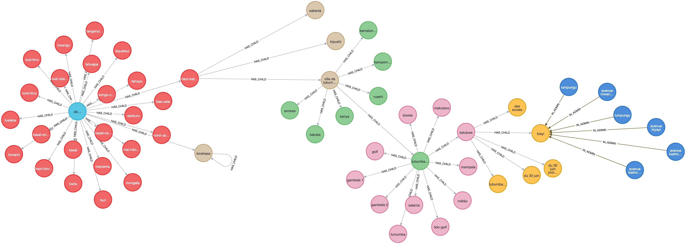

# DRC Administrative Hierarchy



Pipeline to build DR Congo’s administrative hierarchy (and roads) from an OSM
`.osm.pbf`, store it in Postgres/PostGIS, and mirror it into Neo4j. The goal is
to keep an updated database ready for applications and backend services that
need administrative locations: address validation/lookup, populating select
lists, or any feature that must link entities to a clean admin hierarchy.

## Data sources and attribution,

- DR Congo OSM extract: https://download.geofabrik.de/africa/congo-democratic-republic-251204.osm.pbf
- OpenStreetMap CD (RDC) on HDX: https://data.humdata.org/organization/osm-rdc
- Upstream data © OpenStreetMap contributors. Big thanks to Claire Halleux for
  their contributions to OSM DRC: https://wiki.openstreetmap.org/wiki/User:Claire_Halleux.

## What you get

- Up-to-date DR Congo admin hierarchy, ready for integration in apps/services
  that need address lookup, validation, and select lists.
- Domain tables for country → province → city/territory → municipality/commune
  → neighborhood/groupement → locality/village → bloc, with roads anchored to
  the deepest containing admin unit.
- Exports for Postgres and Neo4j (CSV + SQL) under `dataset/`.

## Requirements

- Docker + docker compose
- `osm2pgsql` installed on the host
- OSM extract in `data/` (default: `data/congo-democratic-republic-251204.osm.pbf`)

## Setup

```bash
git clone https://github.com/bernard-ng/drc-admin-hierarchy drc-admin-hierarchy
cd drc-admin-hierarchy

# Place your .osm.pbf in data/ or set OSM_FILE when running the import
cp /path/to/your.osm.pbf data/congo-democratic-republic-251204.osm.pbf
```

## Workflow

0. `docker compose up` settings in `.env` as needed.
1. `make import` — load OSM into Postgres.
2. `make rebuild` — build hierarchy + roads with admin links.
3. `make graph` — create Neo4j nodes/edges. (Neo4j: `http://localhost:7474`, Bolt: `bolt://localhost:7687`.)

Notes:

- Domain table values are trimmed and lowercased.
- Kinshasa is treated as both province and city (province mirrored as city when needed).
- `.env` is read by scripts and compose; adjust for custom ports/credentials.

## Processed datasets

Processed outputs are stored under `dataset/` after running `make rebuild` and `make graph`:

| File                                                       | Description                                                               |
| ---------------------------------------------------------- | ------------------------------------------------------------------------- |
| [data_admin.sql](dataset/postgres/data_admin.sql)          | SQL dump of admin hierarchy domain tables (country through bloc).         |
| [data_osm.sql](dataset/postgres/data_osm.sql)              | SQL dump of raw OSM tables (`osm_boundaries`, `osm_places`, `osm_roads`). |
| [admin_nodes.csv](dataset/graph/admin_nodes.csv)           | Neo4j-ready nodes for admin hierarchy.                                    |
| [admin_edges.csv](dataset/graph/admin_edges.csv)           | Neo4j-ready edges linking admin levels (parent/child).                    |
| [roads.csv](dataset/graph/roads.csv)                       | Roads with names/refs and admin anchors.                                  |
| [road_admin_edges.csv](dataset/graph/road_admin_edges.csv) | Edges between roads and their containing admin units.                     |

## Domain tables and admin levels

Domain tables align to OSM `admin_level` values (see https://wiki.openstreetmap.org/wiki/FR:Key:admin_level):

- `country` — level 2
- `province` — level 4
- `city` (territoire/ville, Kinshasa mirrored) — level 6
- `municipality` (collectivité/commune) — level 7
- `neighborhood` (groupement/quartier) — level 8
- `locality` (localité/village/cellule) — level 9
- `bloc` (subdivision interne) — level 10
- `road` — not an `admin_level`, but each road is anchored to the deepest admin unit it intersects (bloc → country).
